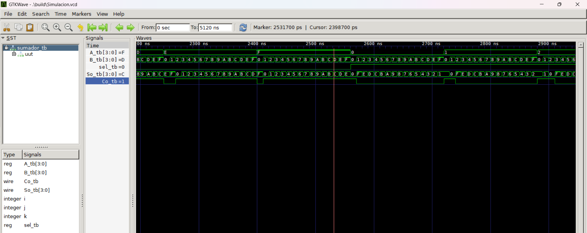
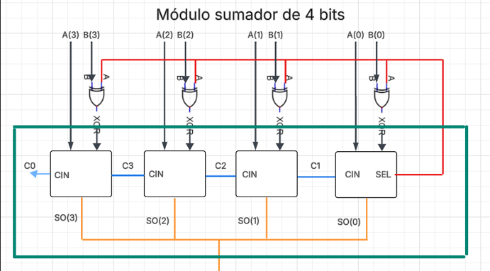

# Lab02 - Sumador/Restador de 4 bits

# Integrantes
* [Brandon Estiven Bravo Gonzalez](https://github.com/brandonesbravogo)
* [Nelson Stiven Pinta Ramirez](https://github.com/Stiven-12)
* [Nicolas David Valbuena Franco](https://github.com/nicolasdavidvalbuenafranco)

# Informe

Indice:

1. [Documentación](#documentación-de-los-circuitos-implementados-implementado)
2. [Simulaciones](#simulaciones)
3. [Evidencias de implementación](#evidencias-de-implementación)
4. [Preguntas](#preguntas)
5. [Conclusiones](#conclusiones)
6. [Referencias](#referencias)

## Documentación del diseño implementado

### 1. Sumador/Restador

#### 1.1 Descripción

El diseño implementado corresponde a un circuito capaz de realizar operaciones de suma y resta de 4 bits utilizando un único sumador de 4 bits como bloque principal.
Para lograr la operación de resta, se emplea la técnica de complemento a 2, lo que permite transformar la resta 𝐴−𝐵 en una suma equivalente:

A-B=A+(~B+1)

El circuito incorpora:

Compuertas XOR conectadas a cada bit de la entrada B.

Cuando Sel = 0, las XOR dejan pasar B sin cambios → operación de suma.
Cuando Sel = 1, las XOR invierten B → complemento a 1.

El bit Sel también se conecta al acarreo inicial (Cin) del sumador de 4 bits, añadiendo el +1 necesario para completar el complemento a 2.

De esta manera, el mismo sumador de 4 bits puede ejecutar ambas operaciones sin modificar su estructura interna. El acarreo final (Co) indica si el resultado es positivo o negativo en complemento a 2.

#### 1.2 Diagramas

## Simulaciones 

### 1. Simulación del sumador/restador

#### 1.1 Descripción

Se realizaron simulaciones para validar el funcionamiento del circuito en ambas operaciones:

Suma (Sel = 0):  
Se verificó que el circuito suma correctamente los operandos A y B, propagando el acarreo entre los sumadores de 1 bit.

Resta (Sel = 1):  
Se comprobó que las compuertas XOR invierten B y que el acarreo inicial Cin = 1 genera el complemento a 2.
Se evaluaron casos donde:

El resultado es positivo (Co = 1).

El resultado es negativo (Co = 0), verificando la representación en complemento a 2.

Las simulaciones permitieron identificar y corregir errores antes de la implementación física en la FPGA.

#### 1.2 Diagrama

A continuación se presenta el diagrama funcional del módulo Sumador/Restador, donde se observa:

- El banco de compuertas XOR que invierte la entrada B cuando Sel = 1.
- La conexión del bit Sel como acarreo inicial (Cin) para completar el complemento a 2.
- El sumador de 4 bits que recibe A, Bx y Cin para producir la salida So y el acarreo Co.

A continuación se muestra el diagrama del circuito:

## Evidencias de implementación

No se realizó evidencia de la implementación

## Conclusiones
Se logró implementar un circuito sumador/restador de 4 bits reutilizando un sumador existente, demostrando la eficiencia del diseño modular.

El uso del complemento a 2 permitió realizar la operación de resta sin necesidad de un restador dedicado.

Las simulaciones fueron fundamentales para validar el comportamiento del circuito antes de su implementación física.

La implementación en FPGA confirmó el funcionamiento correcto del diseño y fortaleció la comprensión de la aritmética binaria y del flujo de datos en sistemas digitales.

## Referencias
[1] M. Morris Mano y M. D. Ciletti, Digital Design, 5th ed. Pearson, 2013.
(Conceptos de sumadores, complemento a 2 y diseño estructural en HDL)

[2] J. Wakerly, Digital Design: Principles and Practices, 4th ed. Pearson, 2006.
(Operaciones aritméticas binarias y circuitos combinacionales)

[3] Universidad ECCI, Guía de Laboratorio – Sumador/Restador de 4 bits, 2024.
(Material base del laboratorio y especificaciones del diseño)

[4] IEEE, IEEE Standard for Verilog Hardware Description Language, IEEE Std 1364-2005.
(Referencia formal del lenguaje Verilog utilizado en el diseño)

[5] A. S. Sedra y K. C. Smith, Microelectronic Circuits, 7th ed. Oxford University Press, 2014.
(Fundamentos de compuertas lógicas y circuitos digitales)
